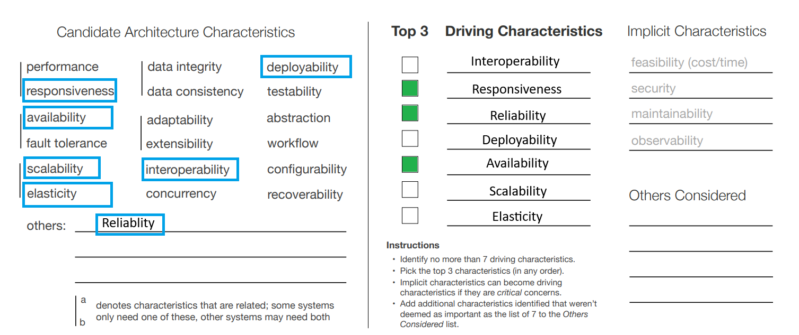

## System Architecture Characteristics

To ensure a successful system implementation, it's vital to prioritize key architecture characteristics. These elements guarantee reliability, availability, and responsiveness, delivering a seamless user experience.

*Figure Architecture Characteristics*

## Reliability

Reliability is another key characteristic, ensuring that the system consistently performs as expected without errors or failures.

- The system must reliably receive, process, and deliver travel updates within 5 minutes of their generation. Any failure in this regard could lead to users missing important information.
- Reliability is also critical when interfacing with external travel systems and agencies, as errors could disrupt the flow of data and lead to user dissatisfaction.

## Availability

Availability is a critical characteristic, especially for a system that travelers rely on for real-time updates and trip management.

- The requirement of a maximum of 5 minutes per month of unplanned downtime is demanding. Achieving high availability may involve redundancy, load balancing, and failover mechanisms.
- Downtime can result in users missing crucial travel updates or being unable to access their trip information, which can have a significant impact on user satisfaction.

## Responsiveness

Responsiveness, in the context of user interfaces, is vital to providing a positive user experience.

- Meeting the specified response time from the web (800ms) and mobile (First-contentful paint of under 1.4 sec) is essential to ensure that users can interact with the system without delays.
- A responsive interface is necessary for users to quickly access and manage their travel reservations and receive timely updates.

