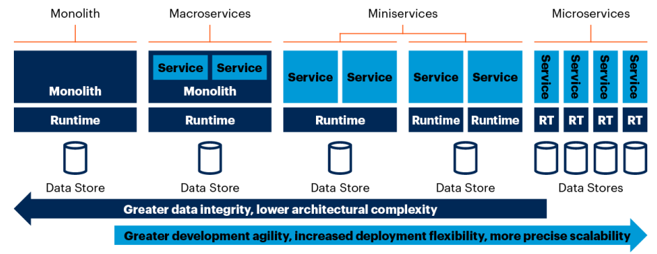
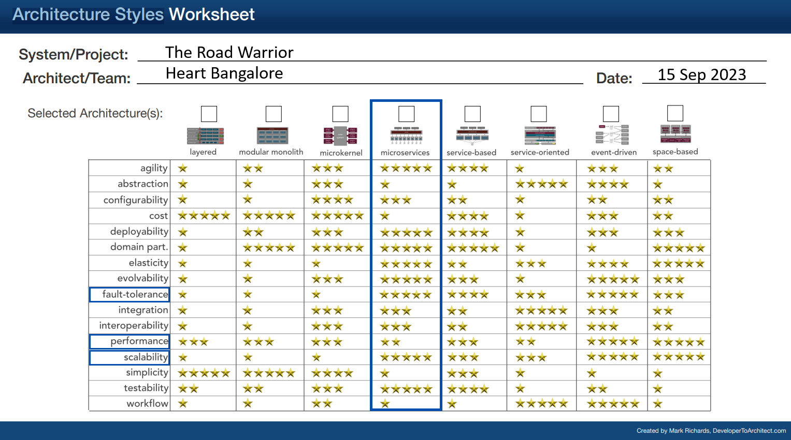

# Architecture Style

*Figure: Service Granularity*

Microservices are not the only alternative to monolithic architectures. A real-world architecture will have services at different levels of granularity. In addition to microservices, Gartner has identified two other “services” patterns: As shown in Figure, these represent points between monolith and microservice on a spectrum of options. As we move further to the right, we are gaining development agility, deployment flexibility and precision of scalability. However, we are giving up data integrity, and the complexity of the application architecture is increasing.

As a startup, Road Warrior prioritizes rapid time-to-market while seeking the benefits of modularity and scalability. Therefore, a '**mini-services**' architecture with a slightly lesser granularity than microservices is a suitable choice.

By adopting a "mini-services" architecture, Road Warrior can strike a balance between rapid development and modularity. This approach allows for quicker iterations, parallel development efforts, and the ability to release new features to the market faster while maintaining a structured and maintainable codebase.

*Figure: Architecture Style*

- Miniservices are similar to microservices but have a larger scope and relaxed architectural constraints. 
- Like a microservice, a miniservice is a physically encapsulated, loosely coupled, independently deployable and scalable application component.
- Miniservices have a broader scope than microservices, often incorporating all the functionality of a given domain. Miniservices can also share backing data stores.
- Each mini-service encapsulates significant functionality, reducing development complexity.
- Services communicate via well-defined APIs (RESTful or GraphQL) for simplicity.
- Aim for independent deployment, allowing for rapid iterations and updates.
- Development teams align with mini-services, enabling parallel development.
- Implement robust testing, CI/CD, and monitoring for reliability.
- Consider transitioning to microservices as the startup grows and complexity increases.

This approach balances speed to market with modularity and maintainability.

## Scalability

- **Granular Scaling**: Mini-services allow for granular scaling of specific parts of the application to meet varying workloads efficiently.

- **Resource Efficiency**: Scalability ensures optimal resource usage, preventing over-provisioning and reducing operational costs.

- **Seamless Growth**: The architecture facilitates the seamless growth of the system as user numbers and data volume increase over time.
## Availability

- **Independent Deployment**: The architecture's emphasis on independent deployment contributes to high availability. If one mini-service experiences issues or requires maintenance, it does not necessarily impact the availability of other services.

- **Robust Testing and CI/CD**: The inclusion of robust testing and CI/CD practices ensures that new updates can be quickly and reliably deployed, minimizing the likelihood of extended downtime.

## Responsiveness

- **Decomposition of Functionality**: By encapsulating significant functionality within each mini-service, the architecture promotes responsiveness. Services can be optimized for their specific tasks, leading to efficient and responsive interactions with users.

- **Parallel Development**: Development teams aligned with mini-services can work in parallel on different aspects of the system, allowing for faster development and quicker response to user needs.
